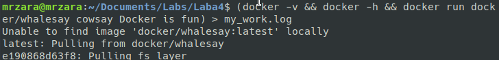
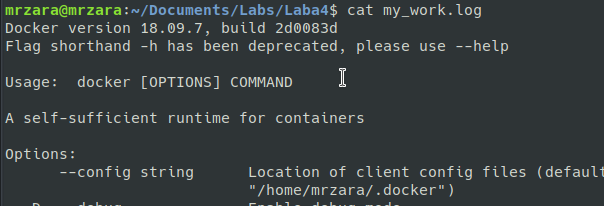
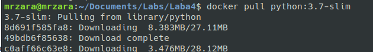
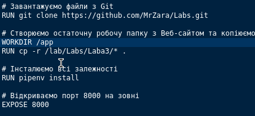
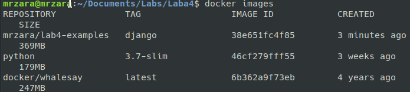
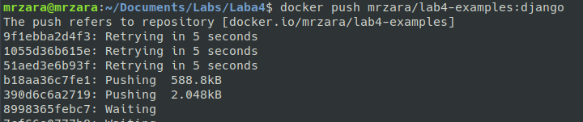
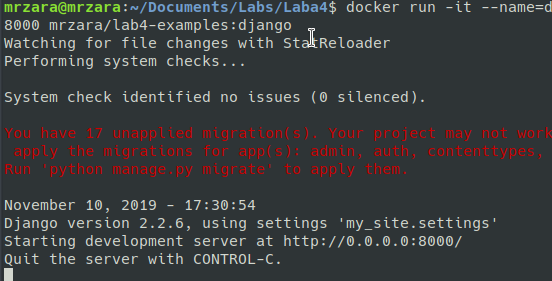
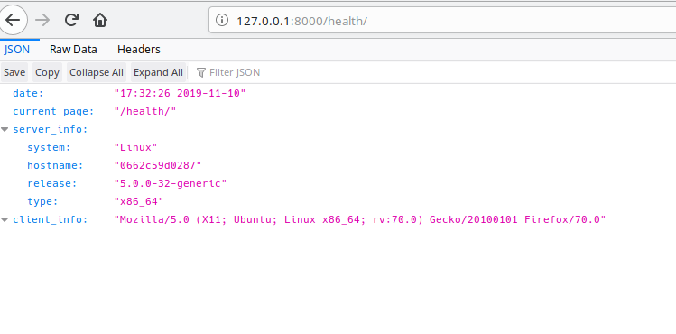
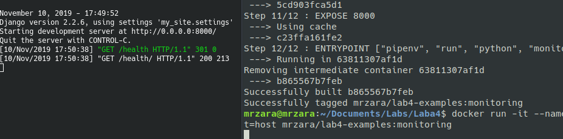

1. 

2. 

створив Dockerfile та скопіював вміст та замінив репозиторій: 

3. docker build -t mrzara/lab4-examples:django .

посилання на репозиторій: https://hub.docker.com/r/mrzara/lab4-examples

4. docker run -it --name=django --rm -p 8000:8000 mrzara/lab4-examples:django

5. Створив ше файл Dockerfile та запустив докер

6. Зробив коміт імеджів до репозиторію та витягнув логи створивши volume 