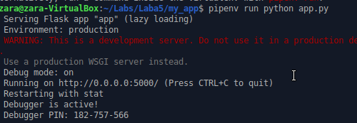
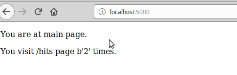
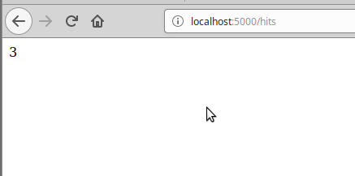
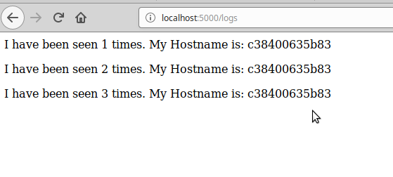
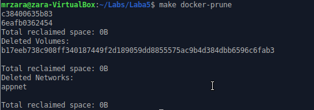

Lab5

1. Прочитав про docker-compose
2. прочитав про flask
3. ok. let's do this
4. okaaaay
5. Створив папку my_app та папку tests. Скопіював файли. файл requirements.txt - містить назви бібліотек проекту
6. перевірив працездатність. Запустив тести
- 
- 

7. видалив файли що створились
8. ознайомився з вмістом. Makefile: 
1) Створюємо змінну з назвою цілей
2) змінна з назвою репозиторію
3) вказуємо що цілі фіктивні (не є файлами)
4) для цілей app та tests - виконуємо створюємо імеджі
5) run - ціль для запуску контейнерів
6) test-app - запуск контейнеру з тестами
7) docker-prune - очищення ресурсів
в
9. змінив тег та назву репозиторію на свій у makefile. запустив створення імеджів. Запустив контейнери:
* 
* 
* 

10. Зупинив та почистив ресурси `make docker-prune`
11. Створив директиву для завантаження імеджів : `docker-push`. завантажив імеджі
12. видалив створені та закачані імеджі:
* 
* створив директиву для видалення всіх імеджів docker-remove
13. створив docker-compose у головній папці та заповнив вмістом з прикладу. мережі потрібні для захищеної внутрішньої комунікації між двома контейнерами. та публічна мережа для доступу інших контейнерів та хосту
14. встановив докер-компоуз та запустив
15. сайт працює. необхідно перейти на 127.0.0.1:80
16. Композ створив імеджі з тегами: bobas/lab4-examples:compose-app та bobas/lab4-examples:compose-tests. змінив імеджі на свої: mrzara/lab4-examples:app та mrzara/lab4-examples:tests. Перезапустив докеркомпоуз
17. Зупинив проект. Почистив ресурси
18. завантажив імеджі
19. краще використовувати компоуз. Він дозволяє ціленаправлено працювати з докером.
20. Створив docker-compose для лабораторної 4
21. Зробив коміт та пул-реквест